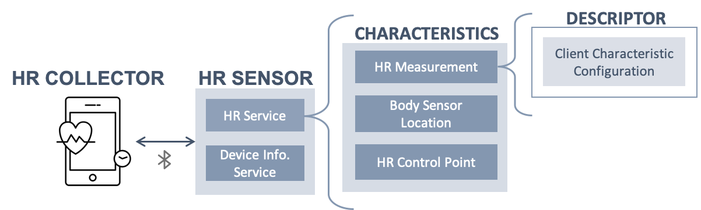
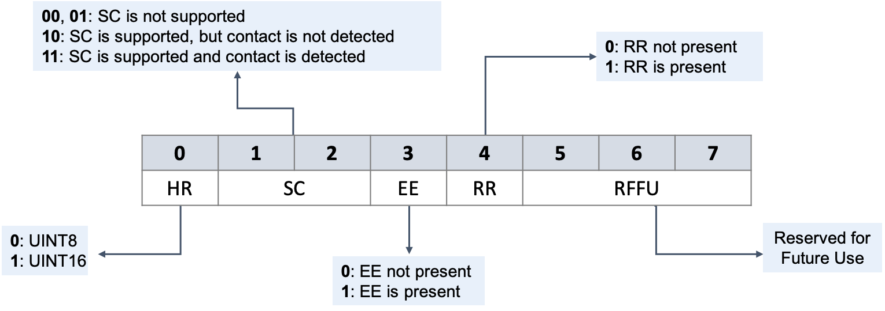

# Bluetooth LE Framework
Devices that communicate over Bluetooth Low Energy technology define the data structure based on the General Attributes ([GATT]( https://learn.adafruit.com/introduction-to-bluetooth-low-energy/gatt)). The GATT framework consists of various **profiles** where each profile composed of one or more **services**. Each service has a set of **characteristics** that indicate the properties and operations of the service. 

For instance, the Heart Rate Profile enables the communication between the Heart Rate Collector and Sensor, where the latter measures the heart rate through the characteristics of the Heart Rate service. The following diagram illustrates the Heart Rate Profile components:

All services and characteristics within the GATT framework are identified with a universally unique ID.

# Heart Rate Service
Within the HR service, there are four main characteristics:

Characteristic  |  Property
-------------------------    | -------------
Heart Rate Measurement (HRM) | Notify
Body Sensor Location         | Read
Heart Rate Control Point     | Write

## HRM Characteristic
The HR collector receives a notification from the HRM characteristic whenever the data is available. The measurements are sent on a 23-bytes of data per Bluetooth LE packet, where the first byte is called **Flag**, and it provides information about the data format.

1. **HR Data Format**: 1-bit that indicates if HR values are in the format of UINT8 or UINT16.
2. **Sensor Contact (SC)**: 2-bits indicating whether the SC feature is supported or not, and if supported whether the device in good or poor contact with the skin.
3. **Energy Expended (EE)**: 1-bit that indicates the presence of the Energy Expended in the HRM characteristic.
4. **RR-Intervals (RR)**: 1-bit that tells whether RR-intervals measurements are present in the HRM characteristic.
5. **RFFU**: 3-bits Reserved for Future Use

## HR values
Based on the format of the HR data whether it is UINT8 or UINT16, the values can be read as 1 or 2 bytes, resepectively. It can be retrieved from the received data packet starting from the byte followed by the flag. The HR values are measured in beats per minute (bpm).

## RR-Intervals
Retrieving RR-intervals from Bluetooth LE packets is not straightforward. Since multiple RR-intervals could be measured between the transmissions of HRM characteristic, the RR-intervals are presented in the sub-fields of the characteristic. The number of sub-fields is determined based on the overall length of the packet, the format of HR values, and the presence of EE. Therefore, 

1. If the format of HR values is **UINT8**, the maximum number of RR-interval values that can be notified with a single HR measurement is:
    * If EE is present, the maximum number of RR-intervals is 8 
    * Otherwise, the maximum number of RR-intervals is 9 
  
2. If the format of HR values is **UINT16**, 
    * If EE is present, the maximum number of RR-intervals is 7 
    * Otherwise, the maximum number of RR-intervals is 8 
    
*Note: the resolution of RR-Intervals is 1/1024 seconds*

### RR Extraction Algorithm

1. Check the flag byte for the following:
  * HR Format
  * Presence of EE
  * Availability of RR-Intervals
  
2. If RR-Intervals are available, then retrieve the data:
  * Combine every two bytes that represent one measurement until the end of the data packet. (RR-Intervals format is UINT16)
  * Convert the measurements to seconds by dividing the RR-Intervals by 1024.