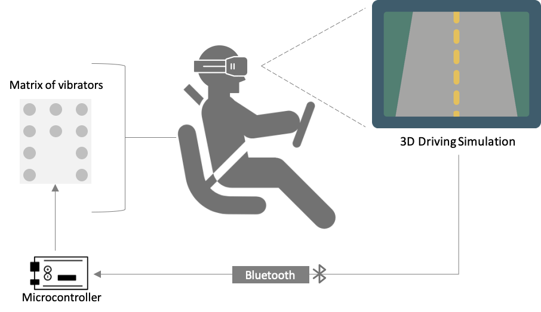

,,
# Overview
In the undergraduate senior project and under the supervision of Dr. [Osama Halabi](https://scholar.google.com/citations?user=jYUTRTcAAAAJ&hl=en), we developed a 3D driving simulation in an immersive environment, that is projected on CAVE and HMD display systems, using [Vizard VR Toolkit](https://www.worldviz.com/vizard). The simulation was integrated with a set of vibrators mounted in the back seat to deliver navigational information to the driver. 

## High-level architecture

A set of 10 vibrators were distributed in the back seat based on several experiments to determine the appropriate intensity of vibration, the pattern, and the minimum distinguishable distance. They have been arranged as 4, 2, 4 vibrators in each column. The first two rows corresponded to the _"straight"_ signal, whereas the first and last columns indicated the _"left"_ and _"right"_ signals respectively.

## Evaluation
A predefined scenario was designed in the 3D driving environment to navigate the drivers to a certain destination. The overall effectiveness of the vibrotactile seat was measured based on the response time and the number of correct responses as compared with audio-directional feedback. The response time was measured between the time the navigational aid was triggered and the time in which the user responded and took action. 

Further details about the design of the tactile seat and the study analyses are discussed in the following papers:
