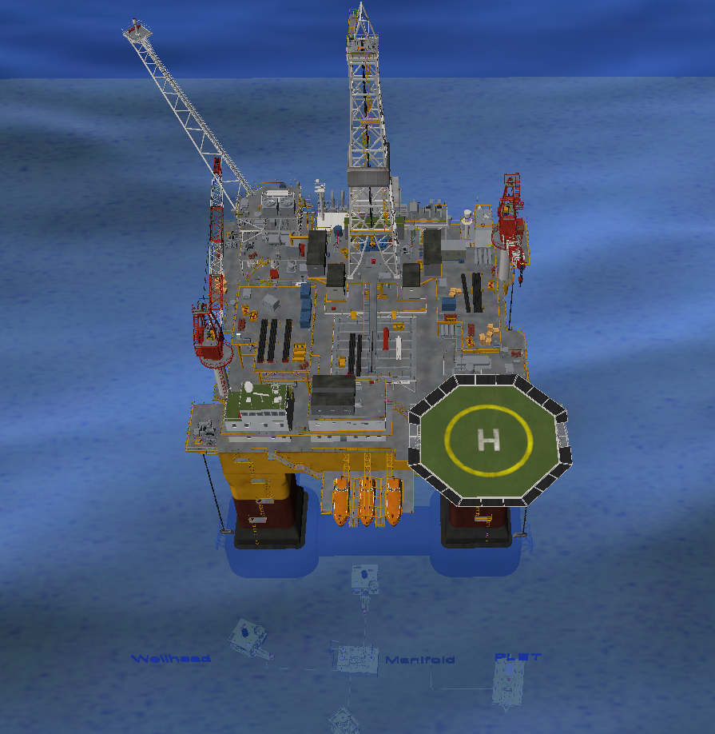
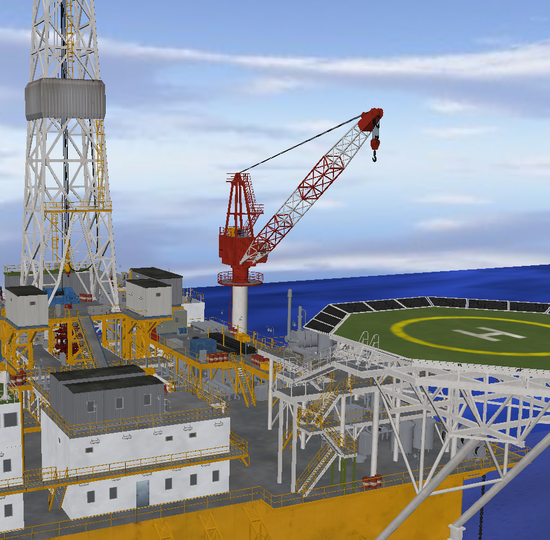
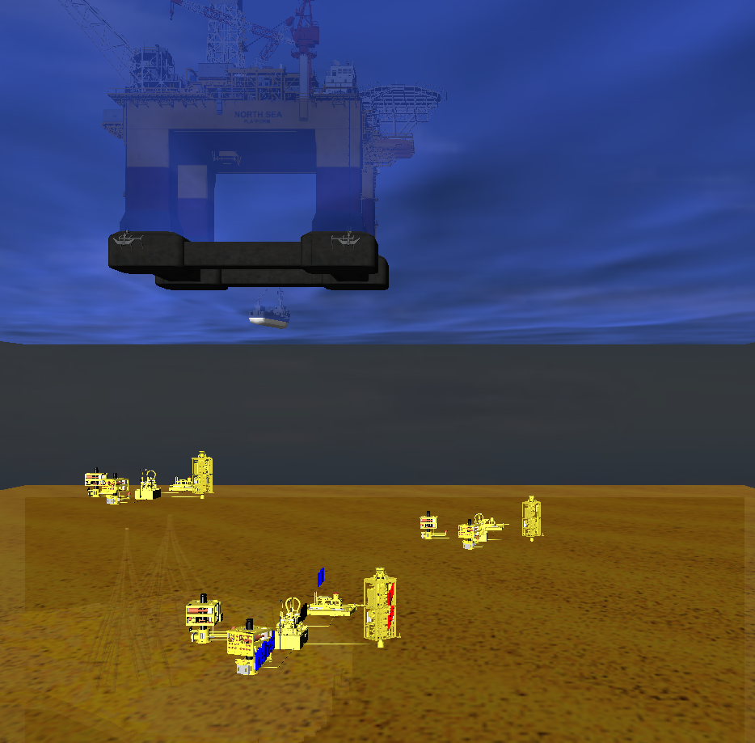

# Overview
The motivation behind this project was to facilitate the learning process of petroleum engineering students by simulating the offshore environment using virtual reality technology.

Therefore, an interactive oil rig platform has been developed using [Vizard VR Toolkit](https://www.worldviz.com/vizard) and 3ds Max to create the animation. The users can navigate through the simulation, explore the different components, and understand their functionalities. The aim was to display the 3D environment in a CAVE system to prepare the students for the industrial experience.

Screenshots of the VR simulation are shown below: 

 |  | 
--- | --- | ---

